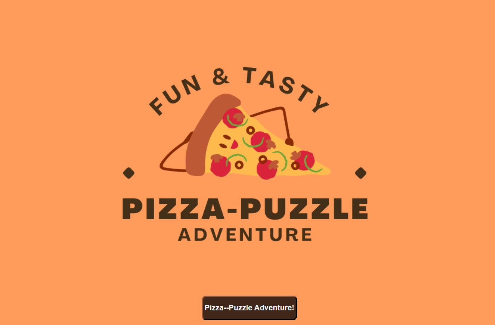
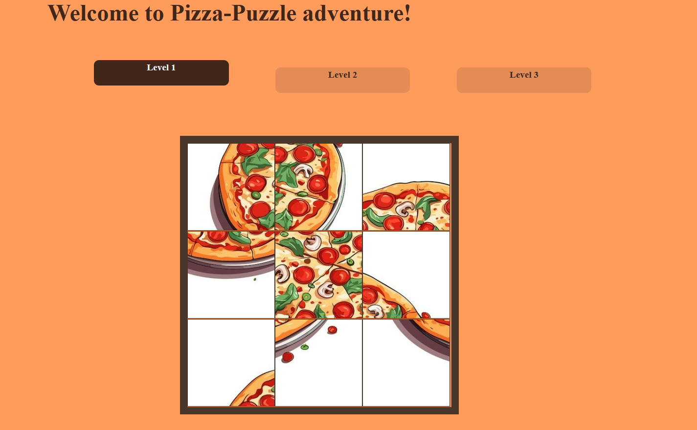
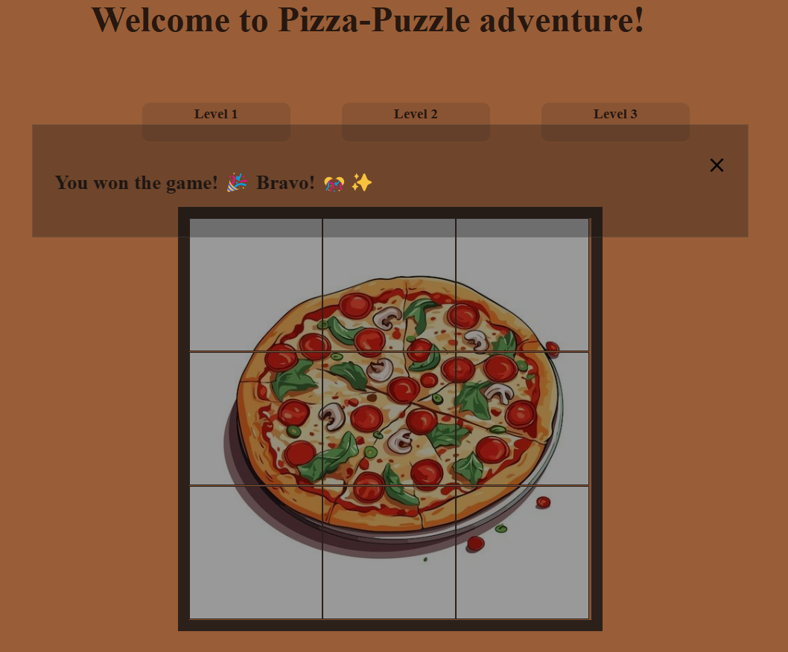

# PIZZA-PUZZLE ADVENTURE!

### Date: 05/01/2024

### By: Hawra Alattar

#### [linkedIn](http://www.linkedin.com/in/hawraalattar) | [GitHub](https://github.com/hawraalattar) | [Instagram](https://www.instagram.com/hawraalattar?igsh=YmVtdzNsdTF3YTgy&utm_source=qr) | [TikTok](https://www.tiktok.com/@aarrwah?_t=8kirmGnTY3N&_r=1)

---

### **_Description_**

Pizza-Puzzle Adventure is a game that helps improve concentration and logic skills. It’s a large puzzle pieces that are easy to pick and move. In this puzzle, the player is expected to drag and drop pieces in a logical way, in order to achieve the desired pattern of the puzzle. This game is a great way to challenge yourself and have fun, as well as encourage attention and problem-solving skills. So, enjoy the Pizza-Puzzle Adventure!

---

### **_Technologies_**

- VS Code
  - HTML
  - CSS
  - Java Script
  - Surge

---

### **_Getting Started_**

1. Click on Pizza-Puzzle Adventure! button to know the gameplay instructions.
2. After reading the instruction, press on Get Started button.
3. A three levels will be shown, click on level 1. Thus, the game board will be displayed.
4. Start by clicking on the puzzle piece that you want to move and drop it in the position you want.
5. Keep dragging and dropping the puzzle until you achieve the desired pattern puzzle.
6. Once you arrive the correct pattern, a popup message will appear! 🎉🥳🎊

---

### **_Screenshots_**

#### Homepage

#### Level-1 Game Board

#### Win Pop-up Message!

---

### **_Future Updates_**

- [ ] Adding a timer.
- [ ] Adding two more levels.
- [x] ~~Congratulations pop-up message feature added~~

---

### **_Credits_**

- **Introduction to game development: [mdn web docs](https://developer.mozilla.org/en-US/docs/Games/Introduction)**

- **Game Logo: [canva](https://www.bing.com/ck/a?!&&p=979421aae2d89ea2JmltdHM9MTcxNDYwODAwMCZpZ3VpZD0zYTE5Y2MyMS01M2M3LTY5YjctMjkzOC1kODQ5NTI2OTY4NmQmaW5zaWQ9NTIwMA&ptn=3&ver=2&hsh=3&fclid=3a19cc21-53c7-69b7-2938-d8495269686d&psq=canva&u=a1aHR0cHM6Ly93d3cuY2FudmEuY29tLw&ntb=1)**

- **Images src: [pinterest](https://www.bing.com/ck/a?!&&p=09a128c159d8a1caJmltdHM9MTcxNDYwODAwMCZpZ3VpZD0zYTE5Y2MyMS01M2M3LTY5YjctMjkzOC1kODQ5NTI2OTY4NmQmaW5zaWQ9NTIwNg&ptn=3&ver=2&hsh=3&fclid=3a19cc21-53c7-69b7-2938-d8495269686d&psq=pinterest&u=a1aHR0cHM6Ly93d3cucGludGVyZXN0LmNvbS8&ntb=1)**
